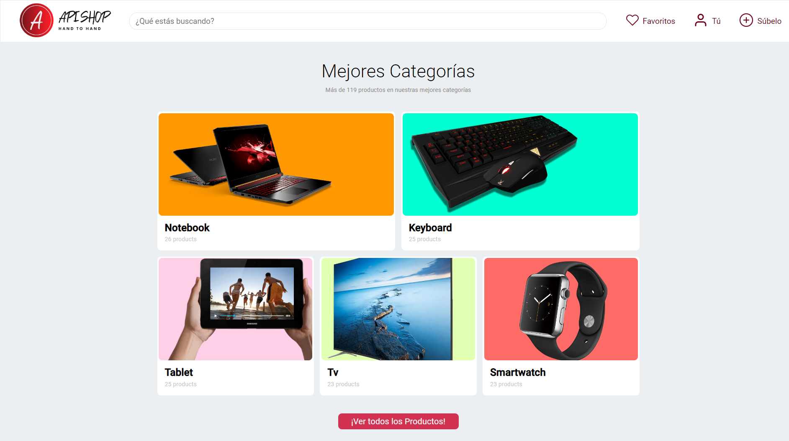

#  API-SHOP COMPRAVENTA DE TECNOLOGÍA.

### DESCRIPCIÓN

Catálogo de compraventa de artículos retro (consolas, PCs, etc). Quien busca algo accede, selecciona lo que le interesa y solicita la compra al precio publicado.

#### Usuarios Anonimos
------------
##### Búsqueda por:
- Nombre.
- Categoría.
- Localidad.
- Precio.

##### Proceso de registro
1. -  Registro (le llega email con código de confirmación para activar la cuenta antes de poder hacer login)
2. - Login

> ○ Email ○ Nombre ○ Password

#### Usuarios Registrados (pueden comprar y vender artículos)
------------
##### Gestión del perfil:
cambio de datos del registro con posibilidad de añadir biografía y foto de perfil

##### Búsqueda por:
- Nombre.
- Categoría.
- Localidad.
- Precio.

##### Publicación de nuevos artículos:
- Nombre.
- Imagen.
- Descripción.
- Categoría.
- Precio.
- Localidad de venta.

##### Proceso de reserva de artículos:
1. El vendedor recibe la propuesta de compra vía email y puede aceptarla y proponer una  	  hora y lugar de entrega.

3. El comprador recibe información sobre si la compra fue aceptada vía email con la
4. información de hora y lugar de entrega.

6. El comprador puede valorar al vendedor sólo después de la entrega.

## Video demo del resultado final!

